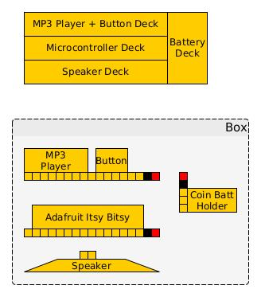

Audio Button
============

Simple audio button based on an Arduino sketch running on the [Adafruit ItsyBitsy
(3.3V variant)](https://www.adafruit.com/product/3675) that controls a [DFPlayer
Mini](https://wiki.dfrobot.com/DFPlayer_Mini_SKU_DFR0299).

The goal of this project will be to simply play a sound or a series of sounds
one at a time upon a certain physical input; Initially, that physical input is a
push of a button, but this can theoretically be expanded to other electrical
signals.

Hardware
--------

A Bill of Materials describing the key hardware components is in the `hw/`
directory as `bom.csv`. Common electrical supplies like wires and solder are
omitted.

Here's how to wire it all up.

Here's how to put it together.

This implies the creation of a separate battery PCB as we don't want this
project to be tethered to a wired power source.

The interconnect diagram shows two sets of three coin batteries as an initial guess.

TODO: Define and create PCB for batteries that provides 4.5V and meets the
current demands of the circuit. These files will be located in a subdirectory
under the `hw/` directory.

Software
--------

This system's behavior is controlled entirely via Arduino sketch, located in
`sw/audio-button/`. At the moment, the only sketch is one that cycles through
the audio files on the SD card.

This and future sketches of course, rely on the provided [DFRobotDFPlayerMini
library for
Arduino](https://github.com/DFRobot/DFRobotDFPlayerMini/archive/1.0.3.zip)

TODO: Add button support.
